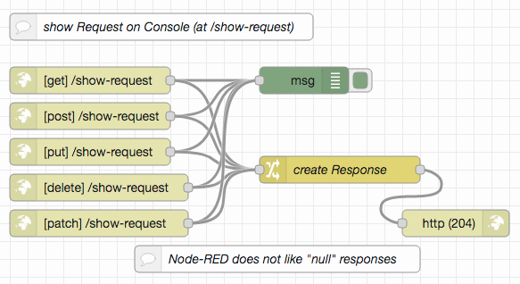
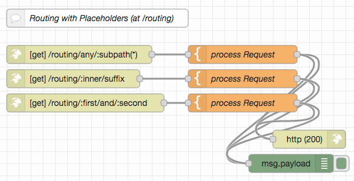
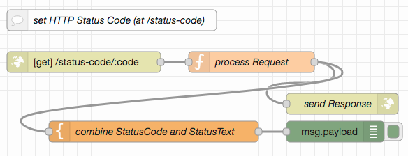

# node-red-http-examples #

This collection of HTTP(S)-related [Node-RED](https://nodered.org/) examples (with a matching [Postman](https://www.postman.com/) collection for testing) is mainly intended for my students, but parts of it may also be of more general interest.

It demonstrates fundamental aspects of HTTP(S) endpoints in Node-RED and is continued in [another series](https://github.com/rozek/node-red-web-server-examples) of examples which demonstrates how to implement *real* (file-based) web servers.

For this series, it is assumed that the reader already installed Node-RED (as described in [Getting Started](https://nodered.org/docs/getting-started/)), optionally secured the editor (as shown in [Securing Node-RED](https://nodered.org/docs/user-guide/runtime/securing-node-red)) and started using it (as explained in [Creating your first flow](https://nodered.org/docs/tutorials/first-flow))

### Recommended Extensions ###

Independent of a specific Node-RED use case, the following extension might be useful:

* [node-red-contrib-components](https://github.com/ollixx/node-red-contrib-components) "Components" allow multiply needed flows to be defined once and then invoked from multiple places

## Examples ##

All example specifications are stored in JSON format and may easily be imported into a Node-RED workspace. Preferrably, you should open a separate tab and insert them there.

To test the examples, a [Postman collection](examples/PostmanCollection.json) is included, which may easily be imported into a running [Postman](https://www.postman.com/) instance. After the import, you should open the collection's "Variables" section and set the `BaseURL` to the base URL of your NodeRED instance (by default, it is set to `127.0.0.1:1880`, which should work out-of-the-box for most Node-RED installations). If your Node-RED instance has been configured to require basic authentication, you should also set the variables `Username` and `Password`)

Alternatively, other tools like [cURL](https://curl.se/) may be used as well.

### Trivial HTTP(S) Server ###

The [first example](examples/trivial-http-server.json) is just to illustrate how easy it can be to implement a web service with Node-RED.

Import the source, "deploy" and send a `GET` request to `{{BaseURL}}/trivial-http-server` (where you replace {{BaseURL}} by the base URL of your Node-RED instance) - the enclosed Postman collection already includes such a request. The response includes a complete (albeit simple) HTML page - but any other result could be sent as well.

### Show Request on Debug Console ###

For own developments, it is often useful to display the complete `msg` of an incoming HTTP request on the debug console.

Import the [example](examples/show-request.json), "deploy", send requests to `{{BaseURL}}/show-request` trying all HTTP methods Node-RED supports and inspect their output.

### Routing (with Placeholders) ###

HTTP servers usually offer more than just a single endpoint - and often, parts of the requested URL control how the response will look like (in the simplest case, the URL contains the path of the file to be sent back).

Node-RED supports the creation of multiple HTTP endpoints and allows their configured URLs to contain "placeholders" (with or without a pattern the requested URL must match in order for the endpoint to be triggered). When matched, these placeholders will be set to the matching parts of the requested URL and may thus be used in response construction.

By default, a placeholder matches all characters up to (and without) the first "/" - if a complete subpath is needed, the placeholder should be followed by the pattern `(*)`

Import the [routing example](examples/routing.json), "deploy" and use the included Postman collection to send various requests to `{{BaseURL}}/routing`. The examples have been programmed to respond with the values of their placeholders - provided that the corresponding endpoints get triggered...

### Query Handling ###

### Setting HTTP Status Codes ###

### Error Handling ###

### Request and Response Header Handling ###

### File Uploads ###

### Virtual Hosts ###

### Delivering different Types of Data ###

### Multiple Endpoints matching the same URL ###

