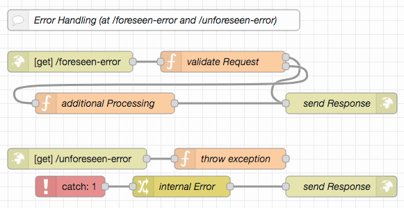
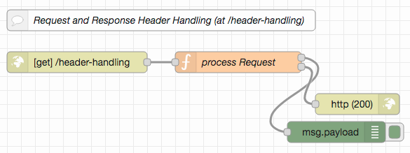
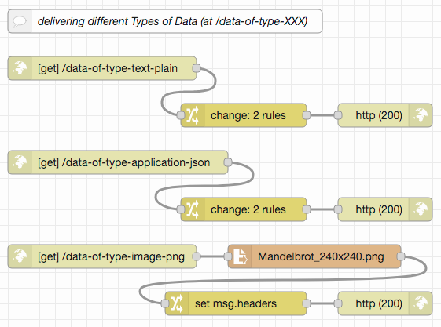
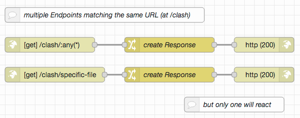

# node-red-http-examples #

This collection of HTTP(S)-related [Node-RED](https://nodered.org/) examples (with a matching [Postman](https://www.postman.com/) collection for testing) is mainly intended for my students, but parts of it may also be of more general interest.

It demonstrates fundamental aspects of HTTP(S) endpoints in Node-RED and is continued in [another series](https://github.com/rozek/node-red-web-server-examples) of examples which demonstrates how to implement *real* (file-based) web servers.

For this series, it is assumed that the reader already installed Node-RED (as described in [Getting Started](https://nodered.org/docs/getting-started/)), optionally secured the editor (as shown in [Securing Node-RED](https://nodered.org/docs/user-guide/runtime/securing-node-red)) and started using it (as explained in [Creating your first flow](https://nodered.org/docs/tutorials/first-flow))

### Recommended Extensions ###

Independent of a specific Node-RED use case, the following extension might be useful:

* [node-red-contrib-components](https://github.com/ollixx/node-red-contrib-components) "Components" allow multiply needed flows to be defined once and then invoked from multiple places

## Examples ##

All example specifications are stored in JSON format and may easily be imported into a Node-RED workspace. Preferrably, you should open a separate tab and insert them there.

To test the examples, a [Postman collection](examples/PostmanCollection.json) is included, which may easily be imported into a running [Postman](https://www.postman.com/) instance. After the import, you should open the collection's "Variables" section and set the `BaseURL` to the base URL of your NodeRED instance (by default, it is set to `127.0.0.1:1880`, which should work out-of-the-box for most Node-RED installations). If your Node-RED instance has been configured to require basic authentication, you should also set the variables `Username` and `Password`)

Alternatively, other tools like [cURL](https://curl.se/) may be used as well.

### Trivial HTTP(S) Server ###

The [first example](examples/trivial-http-server.json) is just to illustrate how easy it can be to implement a web service with Node-RED.

Import the source, "deploy" and send a `GET` request to `{{BaseURL}}/trivial-http-server` (where you replace {{BaseURL}} by the base URL of your Node-RED instance) - the enclosed Postman collection already includes such a request. The response includes a complete (albeit simple) HTML page - but any other result could be sent as well.

### Show Request on Debug Console ###

For own developments, it is often useful to display the complete `msg` of an incoming HTTP request on the debug console.

Import the [example](examples/show-request.json), "deploy", send requests to `{{BaseURL}}/show-request` trying all HTTP methods Node-RED supports and inspect their output.

### Routing (with Placeholders) ###

HTTP servers usually offer more than just a single endpoint - and often, parts of the requested URL control how the response will look like (in the simplest case, the URL contains the path of a file to be sent back).

Node-RED supports the creation of multiple HTTP endpoints and allows their configured URLs to contain "placeholders" (with or without a pattern the requested URL must match in order for the endpoint to be triggered). When matched, these placeholders will be set to the matching parts of the requested URL and may thus be used in response construction.

By default, a placeholder matches all characters up to (and without) the first "/" - if a complete subpath is needed, the placeholder should be followed by the pattern `(*)`

Import the [routing example](examples/routing.json), "deploy" and use the included Postman collection to send various requests to `{{BaseURL}}/routing`. The examples have been programmed to respond with the values of their placeholders - provided that the corresponding endpoints get triggered...

### Query Handling ###

URLs may contain a "query" with "parameters" and "values". Node-RED automatically parses incoming queries and makes their contents available under `msg.req.query`. Usually, the values found their are strings, but if the same parameter appears multiple times, its values are stored in an array

Import the [query handling example](examples/query-handling.json), "deploy" and use the included Postman collection to send a request with an empty, a single and a multiple query parameter to `{{BaseURL}}/query`. The response will contain the actual contents of `msg.req.query` 

### Setting HTTP Status Codes ###

An important part of an HTTP response is its [status code](https://en.wikipedia.org/wiki/List_of_HTTP_status_codes) which informs the client about success or failure and - if the request failed - the reason for failure.

Node-RED allows the status code of a response to be explicitly set. This example combines this feature with URL placeholders and answers an incoming request with the status code it contains.

Import the [status code example](examples/http-status-codes.json), "deploy" and use the included Postman collection to send requests for different status codes to `{{BaseURL}}/status-code`. Responses should contain the requested status code (if known) and a short explanation of their meaning

### Error Handling ###

An important aspect of request processing is the handling of errors - both "foreseen" and "unforeseen" ones.

"Foreseen" errors are simple: just check incoming requests and their contents for mistakes and react by responding with an appropriate HTTP status code. Common I/O and processing errors may be handled similarly using specific "catch" nodes.

Risky are all those errors the programmer does not think of - for those, a generic "catch" node dealing with all exceptions not otherwise caught should always be included and send an "Internal Server Error" (HTTP status code 500) back. 

Import the [error handling example](examples/error-handling.json), "deploy" and use the included Postman collection to send two requests: one to `{{BaseURL}}/foreseen-error` (which responds with 400 "Bad Request") and one to `{{BaseURL}}/unforeseen-error` (which responds with 500 "Internal Server Error")

### Request and Response Header Handling ###

Besides the actual content (the "body") HTTP requests and responses contain several "headers" with additional information about the request (or response). Node-RED allows incoming headers to be inspected and outgoing headers to be defined - both standard as well as non-standard headers are supported.

Import the [header handling example](examples/header-handling.json), "deploy" and use the included Postman collection to test: it contains a request with a "custom-header" whose value will be returned when sent to `{{BaseURL}}/header-handling`. Don't forget to inspect the respopnse headers for the custom one.

### File Uploads ###

A common operation many servers provide is the upload of files. Node-RED supports file uploads out-of-the-box as part of their handling of POST requests.

Import the [file upload example](examples/header-handling.json), "deploy" and use the included Postman collection to send a request to `{{BaseURL}}/file-upload`. As a "proof" of a successful file upload the response will contain the uploaded file's name and its MIME type.

### Virtual Hosts ###

For web site hosters, it is quite common to handle multiple domains within the same server - a feature called "virtual hosts". Technically, these hosts are only distinguished by a special HTTP header (and with a lot of help from the requesting client).

And - since Node-RED supports headers, it also supports the handling of "virtual hosts".

Import the [virtual host example](examples/virtual-hosts.json), "deploy" and use the included Postman collection to send a request to `{{BaseURL}}/virtual-hosts`. The example will respond with the contents of the HTTP "Host" header - which is quite boring when used locally, but may principally be used to serve different domains from a single Node-RED instance

### Delivering different Types of Data ###

HTTP servers may deliver content of different types (as text or in binary form) and with different encodings. HTTP clients (such as browsers) determine the actual type of a response body with the aid of a header called "Content-Type".

Node-RED can send data in both text and binary form. While it may be able to "guess" the data type in some common situations, it is usually a good idea to set this header explicitly.

Import the [data type example](examples/different-data-types.json), "deploy" and use the included Postman collection to send requests to `{{BaseURL}}/data-of-type-text-plain`, `{{BaseURL}}/data-of-type-application-json` and `{{BaseURL}}/data-of-type-image-png`. Because of the "Content-Type" header, Postman will be able to interpret the returned data properly and, e.g., present a returned image by displaying it.

### Multiple Endpoints matching the same URL ###

## License ##

[MIT License](LICENSE.md)
